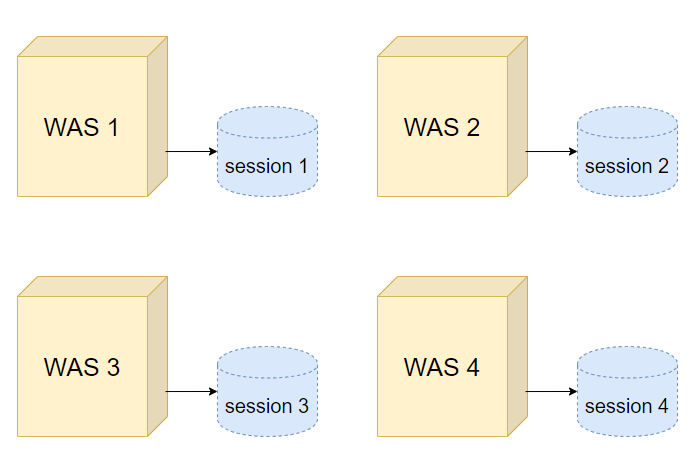
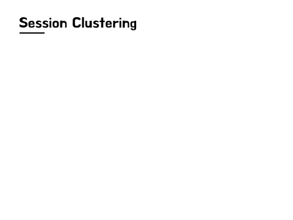
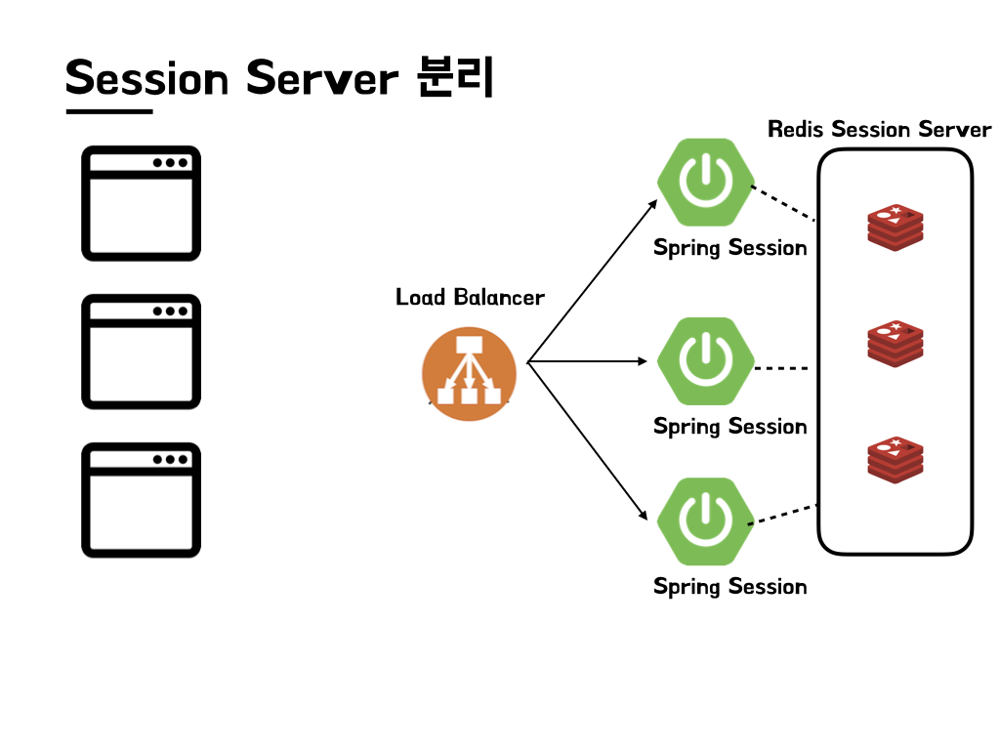

{: .note }
면접 보러 다니던 당시에 알고있던 지식임에도 제대로 대답을 하지못하여 정리하고자 한다.

---

# 세션 클러스터링

세션은 서버 1대에 하나의 저장소가 형성된다.   

나누어진 세션 저장소에 대한 별도의 처리가 없다면 각각의 세션들은 정합성 이슈를 발생시킨다. 위 그림처럼 여러 대로 나뉜 서버가 하나의 서비스를 운영하기 위해서는 4개의 분리된
세션을 하나의 시스템처럼 동작하게 하거나 , 고정된 세션을 사용하여야 합니다.  

세션 클러스터링은 2대 이상의 WAS 또는 서버를 사용할 때 로드 밸런싱, 장애 대비 등 세션 을 공유하는 것을 의미한다.
세션은 사용자 정보 또는 방문기록을 WAS 메모리에 저장하여, 클라이언트와 서버 간 고유한 세션 ID를 통해 Stateless한 연관성을 설정하는 것을 의미한다.  

{: .highlight }
<b>로드밸런싱이란?</b>  
여러 대의 서버를 두고 트래픽을 분산처리하여 서버의 로드율 증가, 부하량, 속도저하 등을 해결해주는 서비스.

## 로드밸런스 사용 시 세션 관리 문제 해결법

### 1. Sticky Session 방식

Sticky Session 이란 말 그대로 고정된 세션을 의미한다.  

즉, Load Balancer는 User가 첫 번째 세션을 생성한 서버로 모든 요청을 리다이렉트 하여 고정된 세션만 사용하게 합니다.
이를 위해서 로드 밸런서는 요청을 받으면 가장 먼저 요청에 쿠키가 존재하는지 확인합니다. 쿠키가 있으면 해당 요청이 쿠키에 지정된 서버로 전송됩니다. 쿠키가 없는 경우에는 로드 밸런서가 기존 로드 밸런싱 알고리즘을 기반으로 서버를 선정합니다.  
동일한 사용자가 계속 해당 서버에 요청을 보낼 수 있도록 지속적으로 서버 정보가 쿠키를 통해 응답에 삽입되어 보내집니다.    

👍 Good  
- 유저는 세션이 유지되는 동안 동일한 서버만을 사용하기 때문에 정합성 이슈에서 자유로워질 수 있습니다.  

👎 Bad  
- 고정된 세션을 사용한다는 것은 특정 서버에 트래픽이 집중될 위험이 있습니다.
- 특정 서버 Fail시 해당 서버에 붙어 있는 세션들이 소실될 수 있다.

### 2. Session Clustring 기법

Sticky Session의 단점을 보완한 방식으로 여러 WAS의 세션을 동일한 세션으로 관리하는 방식이다.

각 WAS들은 세션을 각각 가지고 있지만, 이를 하나로 묶어 클러스터로 관리하는 것이다. 이 상태에서 하나의 WAS가 다운되어도 WAS가 들고 있던 세션은 다른 WAS로 이동되어 그 WAS가 해당 세션을 관리한다.

👎 Bad  
- scale out 시 기존에 존재하던 WAS에 계속 클러스터링 해줘야한다는 번거로움이 있다. ( 기존 시스템 에러 발생 유발 )

### 3. Session 서버를 분리하는 방식

Session Clustering기법의 단점을 극복하기 위해 Redis와 같은 세션 서버를 별도로 분리하는 방식이다.

👍 Good  

- 새로운 서버를 띄우더라도 해당 서버에만 세션 서버의 정보를 적어주고 연결 해주기만 하면 되기 때문에 scale out 시 기존 서버의 수정이 발생하지 않는다.

{: .warning }
서버가 죽을 경우 Redis서버의 모든 세션도 사라지기 때문에 Replication 설정도 필수로 해줘야한다.  

다음 포스트에서는 Redis를 사용하여 세션 정보를 관리하는 코드를 구현해보려 한다.

---

출처:   
- [https://inpa.tistory.com/entry/WEB-🌐-세션Session-불일치-문제-해결법-⸢서버-다중화-환경-⸥#서버_다중화_환경에서의_세션_불일치](https://inpa.tistory.com/entry/WEB-🌐-세션Session-불일치-문제-해결법-⸢서버-다중화-환경-⸥#서버_다중화_환경에서의_세션_불일치)

- [https://hyuntaeknote.tistory.com/6](https://hyuntaeknote.tistory.com/6)

[Google]: http://www.google.com  
[Facebook]: http://www.facebook.com  
